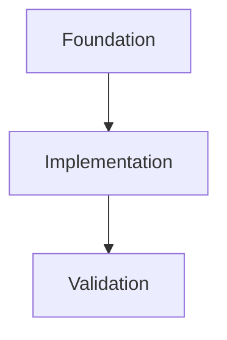

# OKF implementation planning

> **Use when:** creating an implementation plan, task DAG, execution order, or
> one-document-per-task work breakdown. **Do not use when:** documenting the
> current project or architecture without planning work.
>
> **Start with:** Artifact layout, Plan index, Task document, then Dependency and
> status rules. **Search terms:** `depends_on`, `blocks`, task register, Mermaid,
> acceptance criteria, validation.

This reference produces an execution plan, not implementation.

## Ground rules

- Base scope, dependencies, and acceptance criteria on repository evidence; cite
  repository-relative paths and symbols. Resolve material unknowns before
  compiling the execution plan.
- Use YAML front matter for machine-readable metadata and Markdown for the body.
- Use stable task IDs in the form `T-<nnn>`.
- Do not invent owners, dates, repository behavior, or completion status. Use
  `unassigned` or `TBD` where needed. Do not use `proposed` as a task status:
  clarify material requirements before creating execution tasks, and list only
  work approved for execution.
- Make every prerequisite an explicit task ID; do not conceal dependencies in prose.
- Keep status, dependency metadata, and completion evidence consistent as work evolves.

## Boundedness gate

Each executable task has one primary behavioral or architectural invariant and
one coherent validation surface. Split tasks that combine independently
reviewable risk surfaces, especially vendor integration, public API design,
persistence protocol, process interruption, schema migration, concurrency, and
end-to-end validation. Create a prerequisite design or prototype task when the
implementation still requires choosing authority, state ownership, promotion
ordering, recovery behavior, or compatibility policy.

A durability or concurrency task must name:

- The authoritative, candidate, completed, and published states that apply.
- Every freshness, generation, schema, or revision value and which operation owns its mutation.
- Material interruption points and concurrent interleavings.
- The deterministic test or procedure that exercises each boundary.

A bounded task may keep two or more tightly coupled risks among concurrent
writers, process interruption, atomic filesystem/database coordination,
migration, a durable state machine, recovery, or an unstable external
dependency only when they cannot be delivered and reviewed independently.
Split otherwise, and flag the surviving task as high-complexity in its Context
section so the executor briefs its worker accordingly.

## Artifact layout

Follow a repository-provided location and template when present. Otherwise use:

```text
.tasks/okf/<initiative-slug>/
  plan.okf.md
  tasks.okf.md
  tasks/
    T-001-<slug>.okf.md
    T-002-<slug>.okf.md
  task-logs/
    T-001-log.okf.md
```

The planning stage writes a plan index, a task tracker, and one document for
every task. The execution stage creates one task log when each task starts. The
task tracker is the central durable status record; the plan index must not be
the only place that specifies a task.

## Plan index template

```md
---
okf: 1
kind: plan
project: <project name>
status: active | completed | blocked
last_verified: YYYY-MM-DD
sources:
  - path: <repo-relative path>
    purpose: <what this plan is based on>
---

# <Initiative> plan

## Objective
<Measurable outcome.>

## Scope
- In: <...>
- Out: <...>

## Constraints
- <constraint and its evidence>

## Dependency graph


## Execution order
1. T-001 — <why it is ready>
2. T-002 — after T-001

## Cross-task acceptance criteria
- <end-to-end criterion>

## Risks and decisions
| ID | Type | Statement | Affected tasks | Mitigation/decision needed |
| --- | --- | --- | --- | --- |

## Change log
| Date | Change |
| --- | --- |
```

## Task tracker template

```md
---
okf: 1
kind: task-tracker
plan: plan.okf.md
last_verified: YYYY-MM-DD
---

# <Initiative> tasks

| ID | Task | Status | Depends on | Blocks | Document | Log |
| --- | --- | --- | --- | --- | --- | --- |
| T-001 | <title> | ready | — | T-002 | [T-001](tasks/T-001-<slug>.okf.md) | pending |

## Status rules
- `dependent`: approved work waiting on incomplete dependencies.
- `ready`: approved work with all dependencies completed.
- `in_progress`: work actively being executed.
- `blocked`: work with a specific blocker and next step.
- `completed`: work with recorded validation evidence.
- `cancelled`: approved work that will not be executed.

## Change log
| Date | Change |
| --- | --- |
```

## Task document template

```md
---
okf: 1
kind: task
id: T-001
title: <short imperative title>
status: dependent | ready | in_progress | blocked | completed | cancelled
priority: critical | high | medium | low
owner: unassigned
depends_on: []
blocks: []
last_verified: YYYY-MM-DD
sources:
  - path: <repo-relative path>
    purpose: <what this task is based on>
---

# T-001: <title>

## Objective
<Single outcome this task delivers.>

## Context
<Relevant architecture, decisions, and repository evidence. Name exact files,
symbols, interfaces, and conventions the worker should inspect.>

## Scope
- In: <specific files, components, or behavior>
- Out: <explicit exclusions>

## Dependencies
- None. This task has no prerequisites.

## Implementation steps
1. <Concrete, verifiable step.>
2. <Concrete, verifiable step.>

## Test plan
| Test | Level | Behavior proved | Location |
| --- | --- | --- | --- |
| <test to add or update> | unit, integration, end-to-end, or manual | <success, boundary, or failure behavior> | <path or procedure> |

## Edge cases and constraints
- <Behavior at a boundary or failure condition.>
- <Constraint or non-goal that prevents scope drift.>

## Governing invariant
<The single primary invariant this task establishes or preserves.>

## Failure and concurrency matrix
| Boundary or interleaving | Authoritative state | Candidate/completed/published state | Expected recovery or rejection | Validation |
| --- | --- | --- | --- | --- |
| <point> | <state> | <state> | <behavior> | `<test or procedure>` |

## Interfaces and affected areas
| Area | Change/contract | Evidence |
| --- | --- | --- |

## Acceptance criteria
- [ ] <Observable result>
- [ ] <Test, command, or manual check>

## Validation
| Check | Command or procedure | Expected result |
| --- | --- | --- |
| <check> | `<command>` | <result> |

## Risks and decisions
| ID | Type | Statement | Resolution |
| --- | --- | --- |

## Completion record
- Completed: TBD
- Evidence: TBD
- Follow-ups: TBD

## Change log
| Date | Change |
| --- | --- |
```

## Task log template

`execute-plan` creates the log when execution starts. The log is the durable
handoff record for the plan executor, worker, and reviewer.

```md
---
okf: 1
kind: task-log
task: T-001
task_document: ../tasks/T-001-<slug>.okf.md
status: implementing | reviewing | repairing | completed | blocked | needs_input | iteration_limit
iteration: 1
last_verified: YYYY-MM-DD
---

# T-001 execution log

## Current summary
- State: <current state>
- Active agent: <worker, reviewer, or none>
- Next action: <one concrete action>

## Working-tree baseline
- Pre-existing changes: <paths and relevance, or none>

## Decisions
| ID | Iteration | Decision | Reason | Source |
| --- | --- | --- | --- | --- |

## Issues
| ID | Iteration | Status | Issue | Next step |
| --- | --- | --- | --- | --- |

## Worker progress
| Iteration | Files changed | Work completed | Remaining work |
| --- | --- | --- | --- |

## Test and verification evidence
| Iteration | Check | Command or procedure | Result | Evidence |
| --- | --- | --- | --- | --- |

## Reviewer findings
| ID | Iteration found | Status | Finding | Evidence | Resolution |
| --- | --- | --- | --- | --- | --- |

## Event log
| Time | Iteration | Agent | Event |
| --- | --- | --- | --- |

## Final result
- Status: pending
- Summary: TBD
- Open findings: TBD
- Tests: TBD
- Verification: TBD
```

## Dependency and status rules

- `depends_on` lists all prerequisite task IDs; `blocks` is reciprocal.
- A task is `ready` only when every dependency is `completed`, except for a
  documented, approved exception.
- Keep task front matter, `tasks.okf.md`, Mermaid graph, and execution order in
  agreement. `tasks.okf.md` is the central durable status tracker.
- Set a tracker row's `Log` value to `pending` during planning. When execution
  creates the task log, replace `pending` with its repository-relative link.
- Use `blocked` only with a specific blocker and a resolution owner or next step.
- Mark a task `completed` only after acceptance criteria and validation evidence
  are recorded.
- Give every task a test plan that names tests to add or update and the behavior
  each test proves. Use a repeatable manual test only when automation is not
  available, and record the reason.
- Keep the test plan separate from verification. The test plan defines coverage;
  verification records the commands or procedures that prove the completed work.
- Prefer thin vertical slices. Split tasks with independent invariants,
  deliverables, risks, reviewers, or validation; do not split merely to
  increase task count.
- Make each task executable by a lower-cost worker without recovering context
  from the planning conversation. Include exact code landmarks, decided
  behavior, ordered steps, edge cases, and validation results. Split work that
  still requires broad discovery or unresolved architectural judgment.

## Before handoff

Check that every tracked task has exactly one document, dependency IDs resolve
without unapproved cycles, links are valid and repository-relative, and each task
has scope, acceptance criteria, a test plan, verification, risks, and a completion
record. Reject a ready task that spans multiple independent invariants or leaves
a durability or concurrency state model implicit.
